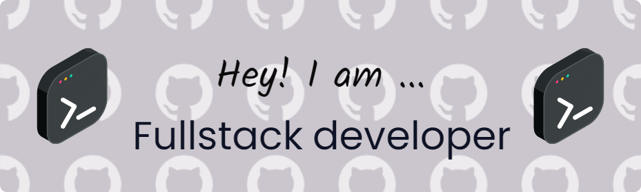

   

<h1 align="center">Hi 👋, I'm Saswata Maitra</h1>
<h3 align="center">GenAI & AI/ML Engineer | MERN Stack Developer | Innovator</h3>

- 🚀 Crafting **agentic and multimodal AI systems** that blend intelligence with seamless user experiences  
- 💻 Architecting and deploying **end-to-end AI/ML solutions** and **full-stack web applications**  
- 🛠️ Proficient in **Python, Java, React, Node.js, MongoDB**, and modern AI tooling (**LLMs, Vector DBs, AI Agents**)  
- 🌟 Merging **software engineering expertise** with **cutting-edge AI innovation**  
- 📂 Explore my projects: [Portfolio](https://portfolio2-6y5e.onrender.com/)  
- 📫 Reach me at **saswata.maitra07@gmail.com**  
- ⚡ Fun fact: **I debug in my sleep and wake up with optimized code.**

---

  

 
  

 

---

<h3 align="left">Connect with me:</h3>

---

<h3 align="left">Languages and Tools:</h3>

 
  
  
  
  
  
  
  
  
  
  
  
  

---

 

&nbsp;
 

 

